# Data Flow

This document provides complete flow diagrams and explanations of how data moves through Beads' three-layer architecture during all operations.

## 🔄 Overview of Data Flow

Beads' data flow follows a clear pattern across its three layers:

```
flowchart TD
    subgraph "User Interface"
        CLI[CLI Commands]
        Hooks[Git Hooks]
        Agent[AI Agent Integration]
    end
    
    subgraph "Layer 3: SQLite (Fast Queries)"
        SQLite[(beads.db)]
        Indexes[(Indexes)]
        Cache[(Query Cache)]
    end
    
    subgraph "Layer 2: JSONL (Operational)"
        JSONL[(issues.jsonl)]
        Interactions[(interactions.jsonl)]
        Routes[(routes.jsonl)]
        Config[(config.yaml)]
    end
    
    subgraph "Layer 1: Git (Historical)"
        GitRepo[Git Repository]
        Remote[Remote Repository]
        Branches[Branches & Merges]
    end
    
    CLI -->|Read| SQLite
    CLI -->|Write| SQLite
    SQLite -->|Append| JSONL
    JSONL -->|Rebuild| SQLite
    
    JSONL <-->|Commit/Pull| GitRepo
    GitRepo <-->|Push/Pull| Remote
    GitRepo -->|Switch| Branches
    
    Hooks -->|Trigger| CLI
    Agent -->|JSON Output| CLI
    Agent -->|Session Events| Hooks
    
    style CLI fill:#e1f5fe
    style SQLite fill:#f3e5f5
    style JSONL fill:#e8f5e8
    style GitRepo fill:#e0f2f1
```

## 📝 Write Operations Flow

### Create Issue Operation

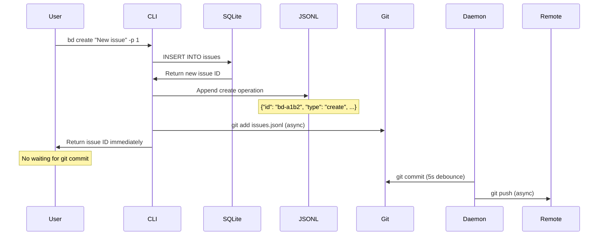

### Update Issue Operation

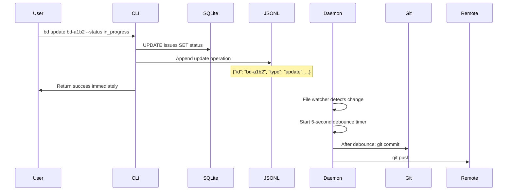

### Add Dependency Operation

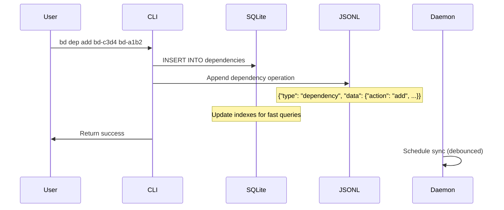

## 📖 Read Operations Flow

### List Issues Query

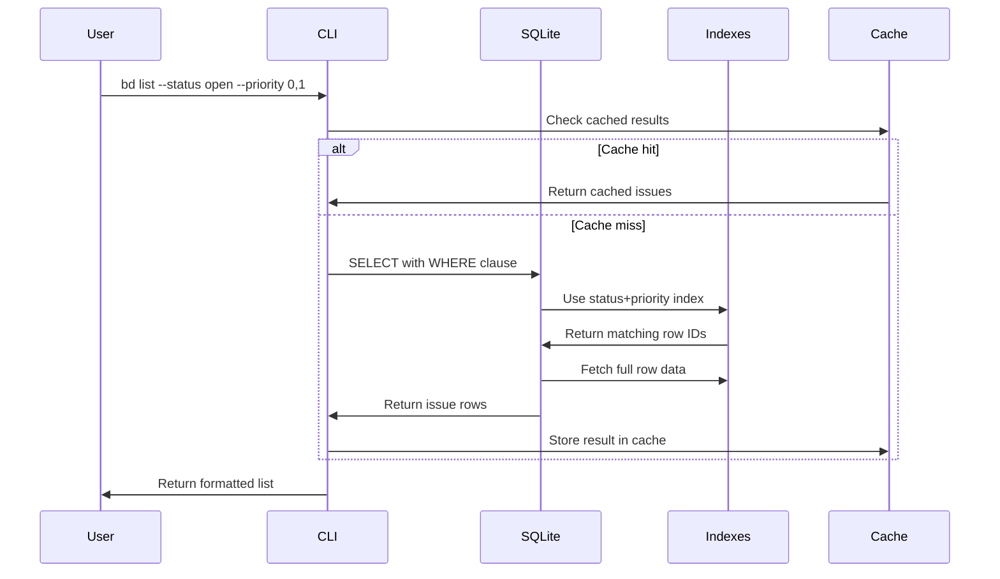

### Ready Work Calculation

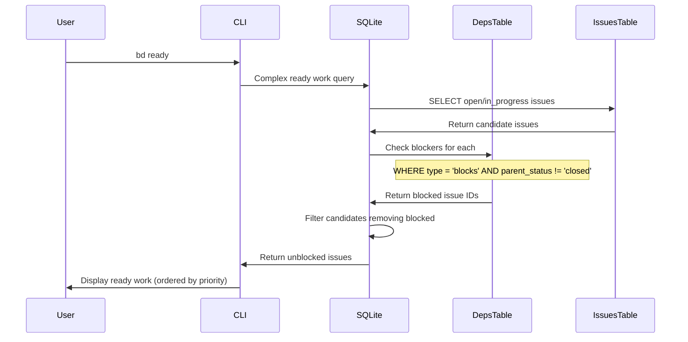

### Show Issue Details

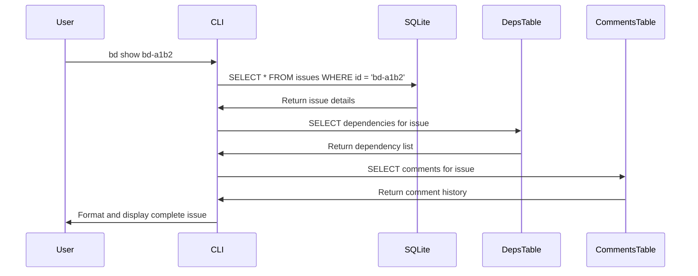

## 🔄 Sync Operations Flow

### Standard Sync Operation

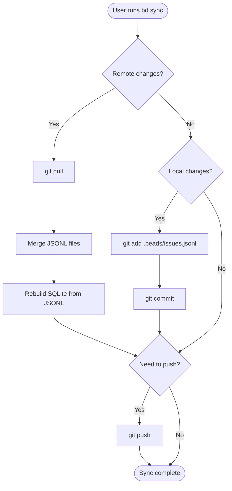

### Daemon-Triggered Sync

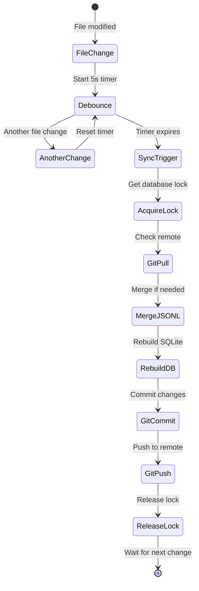

### Import-Only Sync

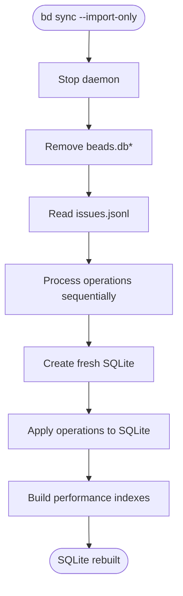

## 🔀 Multi-Agent Data Flow

### Cross-Repository Dependencies

```mermaid
flowchart TD
    subgraph "Repo A: frontend"
        CLI_A[bd create "API integration"]
        JSONL_A[issues.jsonl]
        Dep_A[external:backend-repo/bd-xyz]
    end
    
    subgraph "Repo B: backend"  
        CLI_B[bd dep add bd-local Dep_A]
        JSONL_B[issues.jsonl]
        Routes_B[routes.jsonl]
    end
    
    subgraph "Sync Process"
        Git_A[Git push Repo A]
        Git_B[Git push Repo B]
        Hydrate[bd hydrate --from backend-repo]
    end
    
    CLI_A --> JSONL_A
    JSONL_A --> Dep_A
    Dep_A --> CLI_B
    CLI_B --> JSONL_B
    Routes_B --> Hydrate
    
    JSONL_A --> Git_A
    JSONL_B --> Git_B
    Git_A --> Hydrate
    Git_B --> Hydrate
```

### Agent Handoff Pattern

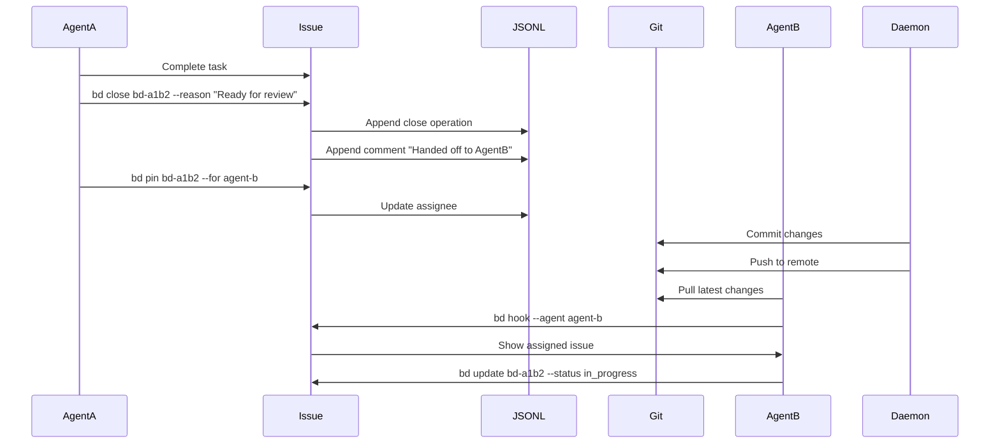

## 🌐 Integration Data Flow

### Claude Code Integration

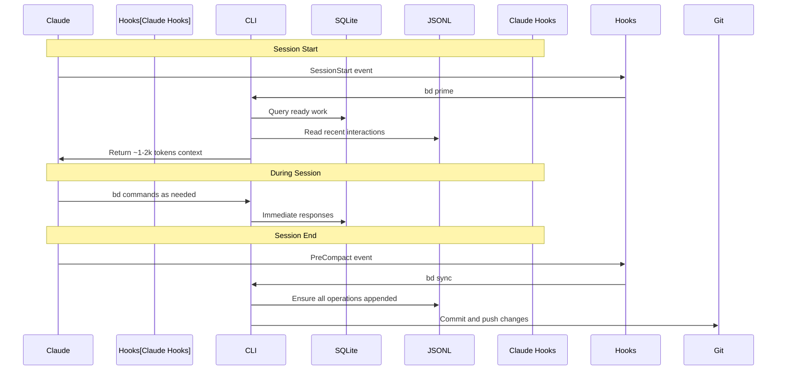

### MCP Server Integration

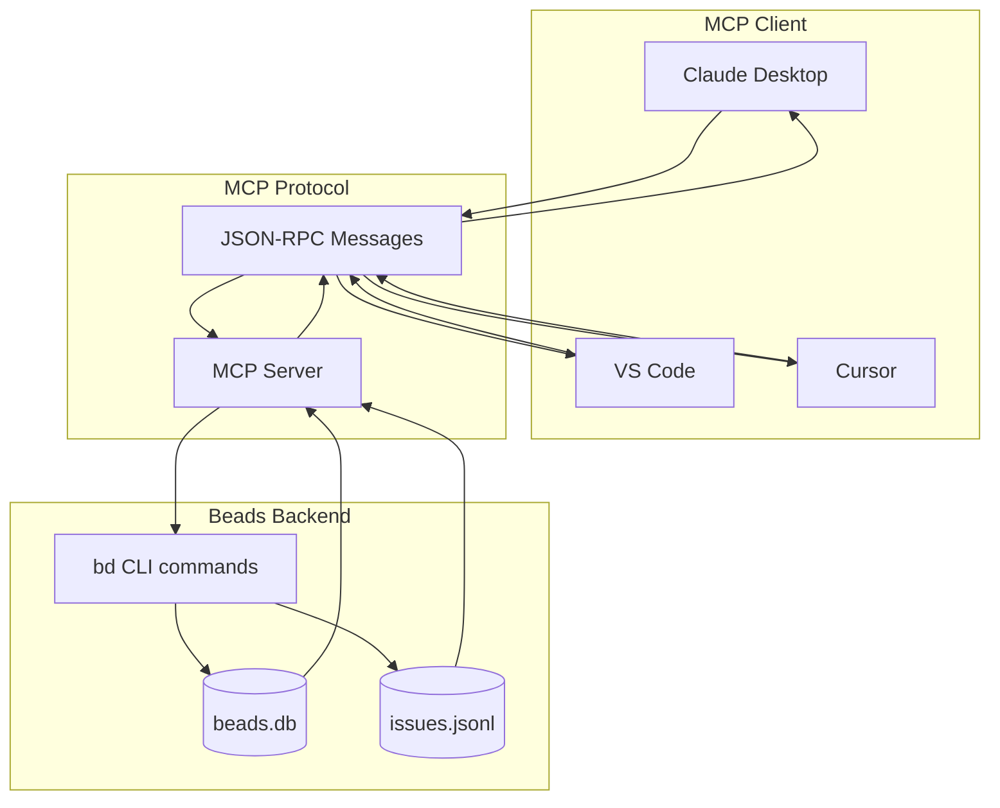

## 🛡️ Error Handling Flow

### Database Corruption Recovery

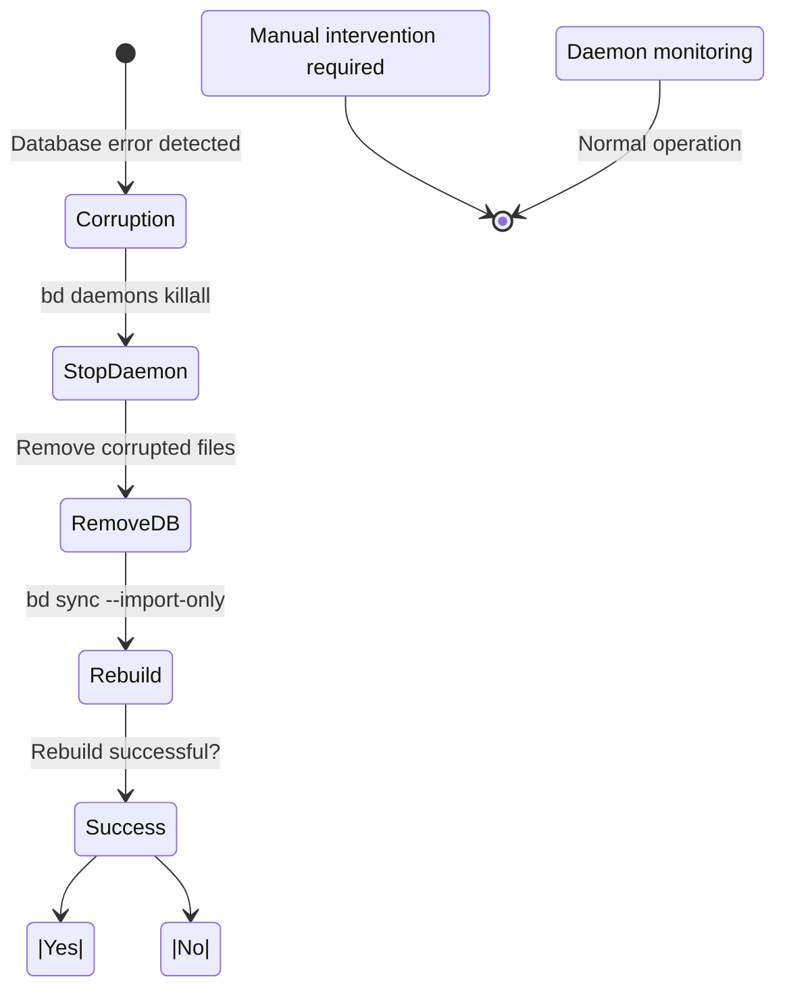

### Git Conflict Resolution

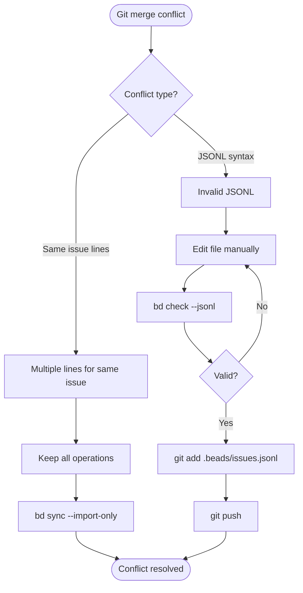

## 📊 Performance Flow Analysis

### Query Optimization Flow

```mermaid
flowchart TD
    Query[User query] --> Parse[Parse SQL]
    Parse --> Plan[Query planner analyzes]
    Plan --> Index{Appropriate index?}
    
    Index -->|Yes| IndexScan[Index range scan]
    Index -->|No| TableScan[Full table scan]
    
    IndexScan --> Filter[Apply filters]
    TableScan --> Filter
    Filter --> Sort[Sort if needed]
    Sort --> Limit[Apply limit]
    Limit --> Return[Return results]
    
    Return --> Cache[Store in query cache]
    
    Note over IndexScan: milliseconds for 10k issues
    Note over TableScan: seconds for 10k issues
```

### Memory Management Flow

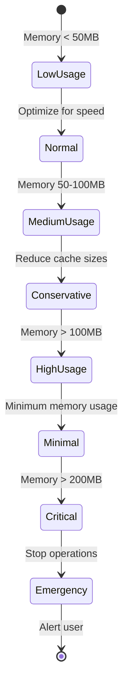

## 🔗 Multi-Repository Flow

### Hydration Process

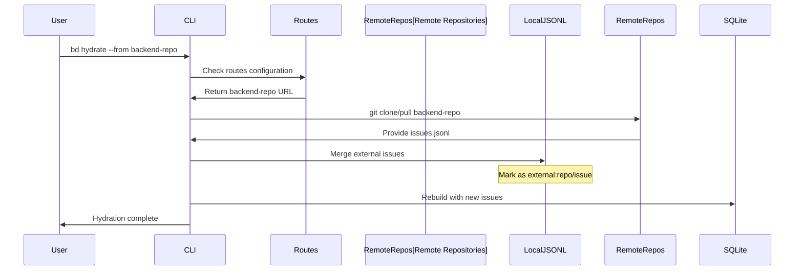

### Cross-Repo Dependency Updates

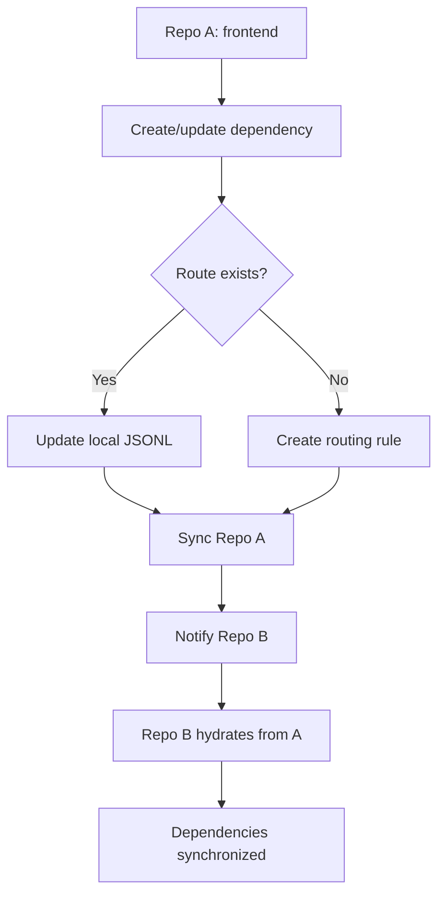

## 🔍 Monitoring Flow

### Daemon Health Monitoring

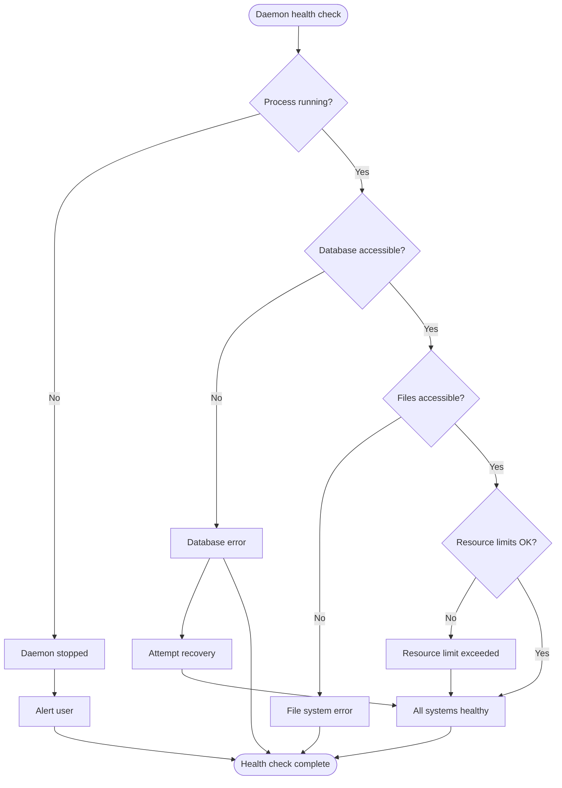

### Performance Metrics Collection

```mermaid
sequenceDiagram
    participant Operations
    participant Metrics
    participant Storage
    participant Alerts
    
    Note over Operations,Alerts: Continuous monitoring
    Operations->>Metrics: Record operation time
    Operations->>Metrics: Record memory usage
    Operations->>Metrics: Record error count
    
    Metrics->>Metrics: Calculate aggregates
    Metrics->>Metrics: Compare with thresholds
    
    alt Threshold exceeded
        Metrics->>Alerts: Trigger alert
        Alerts->>Storage: Log performance issue
    else Normal operation
        Metrics->>Storage: Log normal metrics
    end
```

## 🔗 Related Documentation

- [Architecture Overview](overview.md) - Three-layer system context
- [Git Layer](git-layer.md) - Historical data flow
- [JSONL Layer](jsonl-layer.md) - Operational format details
- [SQLite Layer](sqlite-layer.md) - Database operations
- [Daemon System](daemon-system.md) - Background sync processes

## 📚 See Also

- [CLI Reference](../cli-reference/) - Command-specific flows
- [Multi-Agent](../multi-agent/) - Multi-agent data flows
- [Integrations](../integrations/) - Integration data flows
- [Recovery](../recovery/) - Error handling and recovery flows