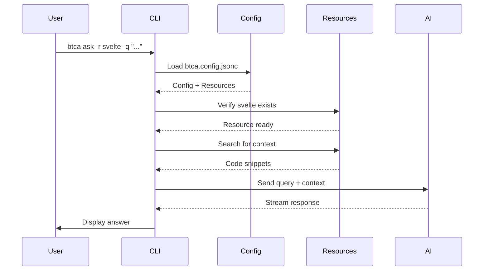
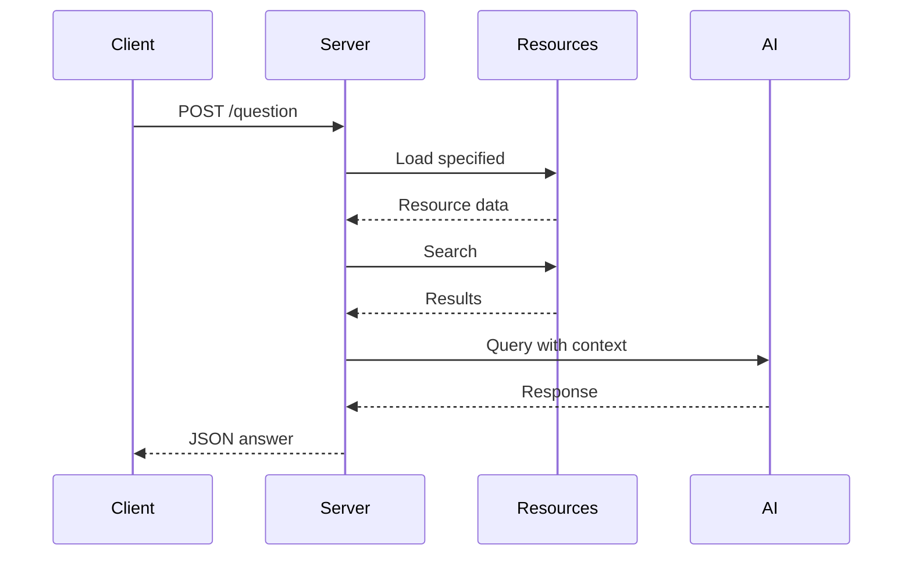
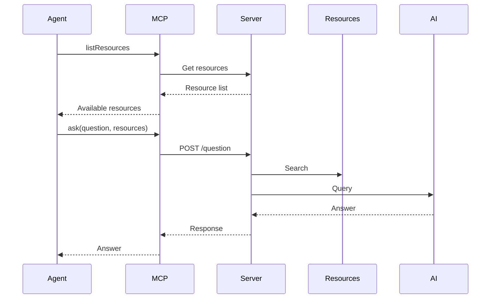

# BTCA Architecture

Understanding how Better Context works under the hood helps you make the most of its capabilities and integrate it effectively into your workflows.

## 🏗️ System Overview

BTCA operates as a multi-component system with three primary modes:

```
┌─────────────────────────────────────────────────────────────┐
│                     BTCA SYSTEM                             │
├─────────────────────────────────────────────────────────────┤
│                                                             │
│  ┌─────────────┐  ┌──────────────┐  ┌─────────────────┐    │
│  │   CLI Tool  │  │ Local Server │  │  Cloud Service  │    │
│  │             │  │              │  │                 │    │
│  │  btca       │  │ btca serve   │  │  btca.dev      │    │
│  │  (TUI/CLI)  │  │  (HTTP API)  │  │  (Hosted)      │    │
│  └──────┬──────┘  └──────┬───────┘  └────────┬────────┘    │
│         │                │                   │             │
│         └────────────────┼───────────────────┘             │
│                          │                                 │
│                   ┌──────▼───────┐                         │
│                   │   Core       │                         │
│                   │   Engine     │                         │
│                   └──────┬───────┘                         │
│                          │                                 │
│         ┌────────────────┼────────────────┐                │
│         ▼                ▼                ▼                │
│   ┌──────────┐    ┌──────────┐    ┌──────────┐            │
│   │ Resources│    │  AI      │    │  Config  │            │
│   │ (Git/Local)   │ Provider │    │  Manager │            │
│   └──────────┘    └──────────┘    └──────────┘            │
│                                                             │
└─────────────────────────────────────────────────────────────┘
```

## 🎨 Three Operating Modes

### 1. CLI Mode (Interactive)

The primary user interface with TUI and REPL:

```
User → btca CLI → Core Engine → AI Provider
                ↓
           Resources
```

**Components**:
- **TUI**: Terminal User Interface (default)
- **REPL**: Read-Eval-Print Loop (`--no-tui`)
- **One-shot**: Single question mode (`btca ask`)

**Data Flow**:
1. User launches `btca`
2. CLI loads configuration
3. User asks question
4. CLI searches resources
5. Query sent to AI provider
6. Answer streamed/displayed

### 2. Local Server Mode (API)

HTTP server for programmatic access:

```
Client → HTTP → btca-server → Core Engine → AI Provider
                           ↓
                      Resources
```

**Endpoints**:
- `GET /health` - Health check
- `GET /resources` - List resources
- `POST /question` - Ask question
- `POST /question/stream` - Streamed response
- `GET /config` - Get configuration
- `POST /config/resources` - Add resource

**Use Cases**:
- Custom integrations
- Multi-client setups
- Background processing
- API-based workflows

### 3. Cloud Mode (Hosted)

Managed service at btca.dev:

```
User → btca.dev → Cloud Sandbox → AI Model
                             ↓
                        Synced Resources
```

**Features**:
- Dedicated sandbox environments
- Pre-configured resources
- No local setup required
- MCP server endpoint
- Web chat interface

## 🧩 Core Components

### Resource Manager

Handles cloning and caching of git repositories and local directories:

```typescript
interface ResourceManager {
  // Clone git repo
  clone(url: string, branch: string): Promise<Resource>
  
  // Index local directory
  index(path: string): Promise<Resource>
  
  // Search resource
  search(resource: string, query: string): Promise<SearchResults>
  
  // Cache management
  update(resource: string): Promise<void>
  clear(): Promise<void>
}
```

**Storage**:
- Location: `~/.btca/resources/` or `./.btca/`
- Format: Cloned git repos, indexed files
- Updates: Manual (`btca update`) or auto

### AI Provider Interface

Abstraction layer for multiple AI providers:

```typescript
interface AIProvider {
  // Send query
  ask(question: string, context: Context): Promise<Answer>
  
  // Stream response
  askStream(question: string, context: Context): AsyncIterable<Chunk>
  
  // Provider info
  getModel(): ModelInfo
  
  // Authentication
  validateAuth(): Promise<boolean>
}
```

**Supported Providers**:
- OpenCode (API key)
- OpenRouter (API key)
- OpenAI (OAuth)
- GitHub Copilot (OAuth)
- Anthropic (API key)
- Google (API key/OAuth)
- OpenAI-Compatible (custom)

### Query Engine

Processes natural language queries against resources:

```
Query Processing Pipeline:
1. Parse question
2. Determine intent
3. Search relevant resources
4. Extract code snippets
5. Build context
6. Send to AI
7. Stream/format response
```

**Search Strategy**:
- Semantic search using embeddings
- Keyword matching
- File path analysis
- Import/reference tracking

### Configuration Manager

Handles configuration files and validation:

```typescript
interface ConfigManager {
  // Load config
  load(path?: string): Promise<Config>
  
  // Save config
  save(config: Config): Promise<void>
  
  // Validate
  validate(config: Config): ValidationResult
  
  // Merge configs
  merge(global: Config, local: Config): Config
}
```

**Config Locations**:
- Global: `~/.config/btca/btca.config.jsonc`
- Project: `./btca.config.jsonc`
- Remote: `./btca.remote.config.jsonc`

## 📡 Data Flow Examples

### CLI Question Flow



### Server API Flow



### MCP Server Flow



## 🔐 Authentication Architecture

### Local Authentication

```
┌─────────────────────────────────────┐
│         Local Auth Flow             │
├─────────────────────────────────────┤
│                                     │
│  User → btca connect               │
│       ↓                             │
│  Provider Selection                 │
│       ↓                             │
│  OAuth / API Key                    │
│       ↓                             │
│  ~/.local/share/opencode/auth.json  │
│                                     │
└─────────────────────────────────────┘
```

**Storage**:
- macOS/Linux: `~/.local/share/opencode/auth.json`
- Windows: `%APPDATA%/opencode/auth.json`

### Cloud Authentication

```
┌─────────────────────────────────────┐
│         Cloud Auth Flow             │
├─────────────────────────────────────┤
│                                     │
│  User → btca remote link           │
│       ↓                             │
│  API Key Input                      │
│       ↓                             │
│  Validate with btca.dev            │
│       ↓                             │
│  ~/.config/btca/remote-auth.json   │
│                                     │
└─────────────────────────────────────┘
```

## 🗄️ Storage Architecture

### Local Storage

```
~/.btca/ or ./.btca/
├── resources/
│   ├── svelte/              # Cloned git repo
│   ├── react/               # Cloned git repo
│   └── my-docs/             # Local directory
├── cache/
│   ├── indexes/             # Search indexes
│   └── embeddings/          # Vector embeddings
└── config/
    └── settings.json        # Additional settings
```

### Cloud Storage

- **Sandbox**: Isolated environment per user
- **Resources**: Synced from user's remote config
- **History**: Question/answer threads stored
- **State**: Managed by btca.dev platform

## 🔌 Integration Points

### MCP Integration

```typescript
// MCP Server Tools
interface Tools {
  listResources: () => Resource[]
  ask: (params: {
    question: string
    resources: string[]
  }) => Answer
}
```

**Transports**:
- stdio (local)
- HTTP (cloud)

### HTTP API

**Local Server** (no auth):
```
Base URL: http://localhost:8080
Endpoints:
- GET /resources
- POST /question
- POST /question/stream
```

**Cloud API** (Bearer auth):
```
Base URL: https://btca.dev/api
Headers: Authorization: Bearer <apiKey>
Endpoints:
- GET /mcp (MCP endpoint)
- GET /projects
- POST /questions
```

## 🚀 Performance Considerations

### Resource Caching

- Git repos cached locally
- Search indexes pre-built
- Embeddings cached for reuse
- Incremental updates supported

### Query Optimization

- Semantic search for relevance
- Context window management
- Streaming for large responses
- Parallel resource queries

### Scalability

**Local**:
- Limited by local resources
- Single user
- File-based storage

**Cloud**:
- Scalable sandbox infrastructure
- Multiple concurrent users
- Managed resource pools

## 🔧 Extension Points

### Custom Providers

Implement `OpenAI-Compatible` interface:

```typescript
// Custom provider config
{
  "provider": "openai-compat",
  "model": "custom-model",
  "providerOptions": {
    "openai-compat": {
      "baseURL": "http://localhost:1234/v1",
      "name": "my-provider"
    }
  }
}
```

### Resource Types

Currently supported:
- Git repositories
- Local directories

Potential extensions:
- API documentation
- Package registries
- Documentation sites

## 🛡️ Security Architecture

### Data Privacy

**Local Mode**:
- All data stays on your machine
- No external API calls except to AI provider
- Resources cloned locally

**Cloud Mode**:
- API key required
- Sandboxed environments
- Isolated resource storage

### Credential Management

- Stored in OS-specific secure locations
- Never committed to repos
- Environment variable overrides supported

## 📊 Monitoring & Observability

### Local Logging

```bash
# Enable verbose logging
btca --verbose

# Log levels
btca --log-level debug
```

### Cloud Analytics

- Usage tracking
- Performance metrics
- Error reporting
- Billing information

## 🔗 Related Documentation

- [CLI Architecture](cli.md) - CLI implementation
- [Local Server](local-server.md) - Server details
- [Cloud Service](cloud-service.md) - Cloud platform
- [MCP Server](mcp-server.md) - MCP implementation

## 📚 See Also

- [Core Features](../core-features/) - Feature details
- [Configuration](../configuration/) - Config system
- [API Reference](../api-reference/) - Endpoints