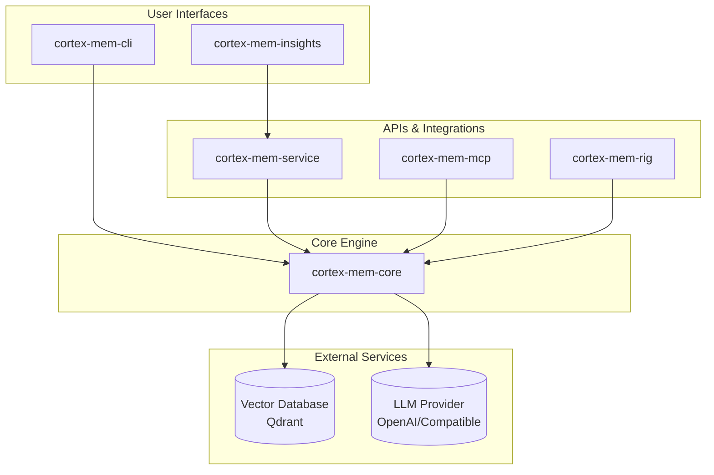

# Cortex Memory Documentation

## 🧠 The Production-Ready Memory System for Intelligent Agents

Cortex Memory is a complete, AI-native memory framework for building intelligent, context-aware applications. Built with Rust, it gives your AI agents high-performance, persistent, and intelligent long-term memory.

---

## What is Cortex Memory?

Cortex Memory transforms stateless AI into intelligent, context-aware partners by:

- **Automatically extracting facts** from conversations using LLMs
- **Storing memories as vectors** for semantic search
- **Organizing and deduplicating** information intelligently
- **Optimizing memories** periodically to maintain quality
- **Providing multiple interfaces**: REST API, CLI, and library

### Before Cortex Memory vs After

| Stateless AI | Intelligent AI with Cortex Memory |
|--------------|-----------------------------------|
| Forgets user details after every session | Remembers user preferences and history |
| Lacks personalization and context | Provides deeply personalized interactions |
| Repeats questions and suggestions | Learns and adapts over time |
| Limited to short-term history | Maintains context across multiple conversations |
| Feels robotic and impersonal | Builds rapport like a true assistant |

---

## Documentation Structure

### Getting Started
- [Installation and Setup](./getting-started/installation.md)
- [Quick Start Guide](./getting-started/quickstart.md)
- [Configuration Guide](./getting-started/configuration.md)

### Core Concepts
- [Architecture Overview](./concepts/architecture.md)
- [Memory Types](./concepts/memory-types.md)
- [Memory Pipeline](./concepts/memory-pipeline.md)
- [Vector Store](./concepts/vector-store.md)
- [Optimization System](./concepts/optimization.md)

### Components

#### Core Library (`cortex-mem-core`)
- [Memory Manager](./core/memory-manager.md)
- [Fact Extraction](./core/fact-extraction.md)
- [Vector Store Interface](./core/vector-store.md)
- [LLM Client](./core/llm-client.md)
- [Types and Data Structures](./core/types.md)

#### Service Layer (`cortex-mem-service`)
- [REST API Overview](./service/overview.md)
- [API Endpoints](./service/endpoints.md)
- [Request/Response Models](./service/models.md)
- [Error Handling](./service/errors.md)

#### Command Line Interface (`cortex-mem-cli`)
- [CLI Commands](./cli/commands.md)
- [Usage Examples](./cli/examples.md)
- [Configuration](./cli/configuration.md)

#### MCP Server (`cortex-mem-mcp`)
- [MCP Integration](./mcp/overview.md)
- [Available Tools](./mcp/tools.md)
- [Configuration](./mcp/configuration.md)

#### Rig Integration (`cortex-mem-rig`)
- [Rig Framework Integration](./rig/overview.md)
- [Memory Tools](./rig/tools.md)
- [Agent Integration](./rig/agent-integration.md)

### Configuration
- [Configuration File](./config/file.md)
- [Qdrant Settings](./config/qdrant.md)
- [LLM Settings](./config/llm.md)
- [Memory Settings](./config/memory.md)
- [Server Settings](./config/server.md)

### Examples
- [Basic Usage](./examples/basic.md)
- [Integration with Agents](./examples/agent-integration.md)
- [Cortex TARS Showcase](./examples/cortex-tars.md)
- [Memory Optimization](./examples/optimization.md)

### API Reference
- [Rust API](./api/rust.md)
- [REST API](./api/rest.md)
- [MCP Schema](./api/mcp.md)

### Advanced Topics
- [Performance Tuning](./advanced/performance.md)
- [Security Considerations](./advanced/security.md)
- [Deployment Guide](./advanced/deployment.md)
- [Troubleshooting](./advanced/troubleshooting.md)

---

## The Cortex Memory Ecosystem



---

## Key Features

### Intelligent Fact Extraction
Automatically extracts key facts and insights from unstructured text using LLMs. Supports dual-channel extraction from both user and assistant messages.

### Memory Classification & Deduplication
Organizes memories by type and removes redundant information to keep the knowledge base clean and efficient.

### Automated Memory Optimization
Periodically reviews, consolidates, and refines memories to improve relevance and reduce storage costs.

### Vector-Based Semantic Search
Finds the most relevant memories using high-performance vector similarity search powered by Qdrant.

### Multi-Modal Access
Interact with the memory system through:
- REST API for any programming language
- Command-line interface for developers
- Rust library for native integration
- MCP server for AI agent frameworks

### Web Dashboard
A dedicated web UI (`cortex-mem-insights`) for monitoring, analyzing, and visualizing the agent's memory.

---

## Benchmarks

Cortex Memory has been rigorously evaluated against LangMem using the **LOCOMO dataset** (50 conversations, 150 questions):

| Metric | Cortex Memory | LangMem | Improvement |
|--------|---------------|---------|-------------|
| **Recall@1** | 93.33% | 26.32% | **+67.02pp** |
| **Recall@3** | 94.00% | 50.00% | +44.00pp |
| **Recall@5** | 94.67% | 55.26% | +39.40pp |
| **MRR** | 93.72% | 38.83% | **+54.90pp** |
| **NDCG@5** | 80.73% | 18.72% | **+62.01pp** |
| **NDCG@10** | 79.41% | 16.83% | **+62.58pp** |

---

## Installation

```bash
# Install the CLI for command-line management
cargo install cortex-mem-cli

# Install the REST API Service for application integration
cargo install cortex-mem-service

# Install the MCP server for agent framework integrations
cargo install cortex-mem-mcp

# Install as a library (add to Cargo.toml)
[dependencies]
cortex-mem-core = "1.0"
```

---

## Quick Example

```rust
use cortex_mem_core::{MemoryManager, Config};

#[tokio::main]
async fn main() -> Result<(), Box<dyn std::error::Error>> {
    // Load configuration
    let config = Config::load("config.toml")?;
    
    // Initialize memory manager
    let memory_manager = initialize_memory_system(&config).await?;
    
    // Store a memory
    let memory_id = memory_manager.store(
        "The user prefers Rust over Python for system programming.".to_string(),
        MemoryMetadata::new(MemoryType::Personal)
            .with_user_id("user123".to_string())
    ).await?;
    
    // Search for memories
    let results = memory_manager.search(
        "What programming language does the user prefer?",
        &Filters::for_user("user123"),
        5
    ).await?;
    
    println!("Found {} relevant memories", results.len());
    
    Ok(())
}
```

---

## Community Showcase: Cortex TARS

[Cortex TARS](./examples/cortex-tars.md) is a production-ready TUI application demonstrating Cortex Memory's capabilities:

- **Multi-Agent Management**: Run multiple AI personas simultaneously
- **Persistent Role Memory**: Each agent maintains independent long-term memory
- **Memory Isolation**: Complete separation between agents and users
- **Real-Time Audio-to-Memory**: Captures conversations and converts to searchable memories

---

## Contributing

We welcome contributions! Please see our [GitHub repository](https://github.com/sopaco/cortex-mem) for:
- Bug reports and feature requests
- Pull requests
- Documentation improvements

---

## License

Cortex Memory is licensed under the **MIT License**.

---

## Next Steps

- [Get Started with Installation](./getting-started/installation.md)
- [Explore the Architecture](./concepts/architecture.md)
- [View Code Examples](./examples/basic.md)
