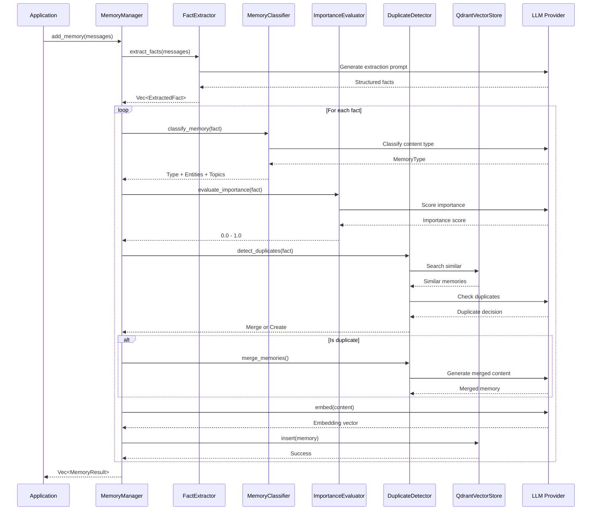
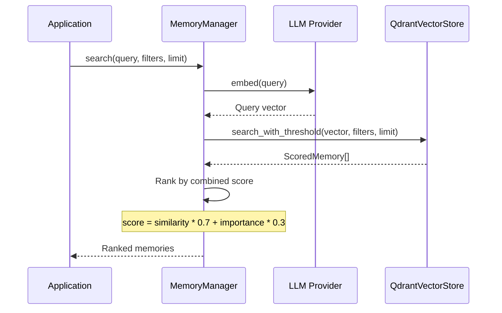

# Architecture Overview

Cortex Memory is designed as a modular, layered system that separates concerns while providing a cohesive memory management experience for AI agents.

---

## System Architecture

```
┌─────────────────────────────────────────────────────────────┐
│                      User Interfaces                        │
├──────────────┬──────────────┬──────────────┬───────────────┤
│ cortex-mem-  │ cortex-mem-  │ cortex-mem-  │ Your          │
│ cli          │ service      │ insights     │ Application   │
└──────┬───────┴──────┬───────┴──────┬───────┴───────┬───────┘
       │              │              │               │
       └──────────────┴──────┬───────┴───────────────┘
                             │
┌────────────────────────────▼──────────────────────────────┐
│                    Integration Layer                      │
├──────────────┬──────────────┬─────────────────────────────┤
│ cortex-mem-  │ cortex-mem-  │  Direct Library Usage       │
│ mcp          │ rig          │                             │
└──────┬───────┴──────┬───────┴──────────────┬──────────────┘
       │              │                      │
       └──────────────┴──────────┬───────────┘
                                 │
┌────────────────────────────────▼──────────────────────────┐
│                     Core Engine                           │
│                  (cortex-mem-core)                        │
├──────────────┬──────────────┬──────────────┬─────────────┤
│ Memory       │ Fact         │ Vector       │ LLM         │
│ Manager      │ Extractor    │ Store        │ Client      │
└──────┬───────┴──────────────┴───────┬──────┴─────────────┘
       │                              │
       │         ┌──────────────────┐ │
       │         │   Optimization   │ │
       │         │     System       │ │
       │         └──────────────────┘ │
       │                              │
       └──────────────┬───────────────┘
                      │
┌─────────────────────▼─────────────────────────────────────┐
│                  External Services                        │
├────────────────────┬──────────────────────────────────────┤
│  Vector Database   │         LLM Provider                 │
│     (Qdrant)       │    (OpenAI/Compatible)               │
└────────────────────┴──────────────────────────────────────┘
```

---

## Component Details

### 1. User Interfaces Layer

#### cortex-mem-cli
- Command-line interface for developers
- Direct interaction with memory store
- Testing and debugging capabilities
- Administrative operations

#### cortex-mem-service
- HTTP REST API server
- Language-agnostic integration
- Built with Axum web framework
- CORS support for web applications

#### cortex-mem-insights
- Web-based dashboard (Svelte-based)
- Real-time memory monitoring
- Analytics and visualization
- Memory management UI

### 2. Integration Layer

#### cortex-mem-mcp
- Model Context Protocol (MCP) server
- Integration with AI agent frameworks
- Standardized tool interface
- JSON-RPC communication

#### cortex-mem-rig
- Integration with Rig LLM framework
- Memory tools for Rig agents
- Native Rust async/await support
- Type-safe tool definitions

### 3. Core Engine (cortex-mem-core)

The heart of the system containing all business logic:

#### Memory Manager
- Orchestrates all memory operations
- Coordinates between components
- Provides high-level API
- Manages memory lifecycle

#### Fact Extractor
- Uses LLM to extract facts from conversations
- Dual-channel extraction (user + assistant)
- Language detection
- Smart filtering and deduplication

#### Vector Store
- Abstraction over vector databases
- Currently supports Qdrant
- Pluggable architecture for other stores
- Auto-detection of embedding dimensions

#### LLM Client
- OpenAI-compatible API support
- Text generation (completions)
- Embeddings generation
- Structured extraction using Rig

#### Optimization System
- Automated memory optimization
- Duplicate detection and merging
- Quality improvement
- Space optimization

### 4. External Services

#### Vector Database (Qdrant)
- Stores memory vectors
- Provides semantic search
- Metadata filtering
- High-performance retrieval

#### LLM Provider
- Generates text and embeddings
- Extracts facts from conversations
- Classifies and scores memories
- OpenAI-compatible API

---

## Data Flow

### Memory Storage Flow



### Memory Retrieval Flow



---

## Key Design Principles

### 1. Separation of Concerns
Each crate has a specific responsibility:
- `cortex-mem-core`: Business logic
- `cortex-mem-service`: HTTP API
- `cortex-mem-cli`: CLI interface
- `cortex-mem-config`: Shared configuration

### 2. Async-First Architecture
- Built on Tokio runtime
- Non-blocking I/O operations
- Concurrent processing where possible
- Efficient resource utilization

### 3. Type Safety
- Extensive use of Rust's type system
- Compile-time guarantees
- Structured data with serde
- Error handling with Result types

### 4. Pluggable Components
- Vector store trait for different backends
- LLM client abstraction
- Configurable extractors and evaluators
- Easy to extend and customize

### 5. Intelligent Automation
- Automatic fact extraction
- Smart deduplication
- Importance scoring
- Periodic optimization

---

## Performance Characteristics

### Memory Storage
- **Latency**: ~100-500ms per memory (including LLM calls)
- **Throughput**: Depends on LLM rate limits
- **Bottleneck**: LLM API calls for extraction/enhancement

### Memory Retrieval
- **Latency**: ~10-50ms for vector search
- **Throughput**: 1000+ queries/second (Qdrant-dependent)
- **Scaling**: Horizontal scaling with Qdrant cluster

### Optimization
- **Background Process**: Non-blocking
- **Batch Operations**: Configurable batch sizes
- **Resource Usage**: Controlled by configuration

---

## Scalability Considerations

### Horizontal Scaling
- Qdrant supports clustering
- Multiple service instances behind load balancer
- Stateless service design

### Vertical Scaling
- Efficient Rust implementation
- Memory-safe operations
- Optimized data structures

### Data Partitioning
- By user_id for multi-tenant setups
- By agent_id for agent isolation
- Time-based partitioning for optimization

---

## Security Architecture

### Data Isolation
- User ID-based filtering
- Agent ID isolation
- Run ID scoping

### API Security
- API key authentication (external)
- CORS configuration
- Request validation

### Data Privacy
- No data persistence in service layer
- All data in vector store (user-controlled)
- Configurable retention policies

---

## Next Steps

- [Memory Pipeline](./memory-pipeline.md) - Deep dive into the memory processing flow
- [Memory Types](./memory-types.md) - Understand different memory categories
- [Vector Store](./vector-store.md) - Learn about vector storage and search
- [Optimization System](./optimization.md) - Automated memory optimization
