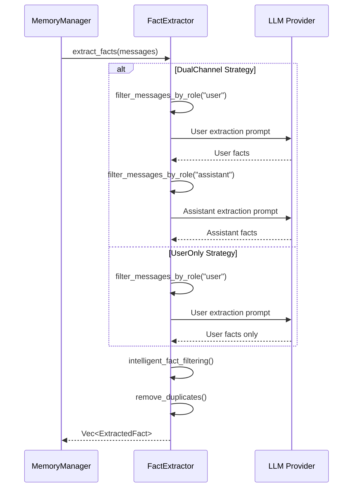
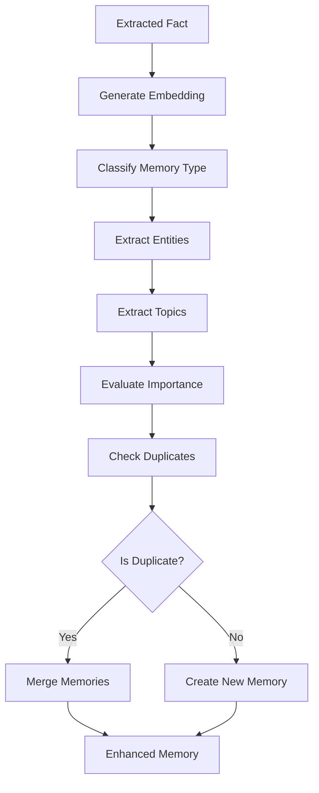
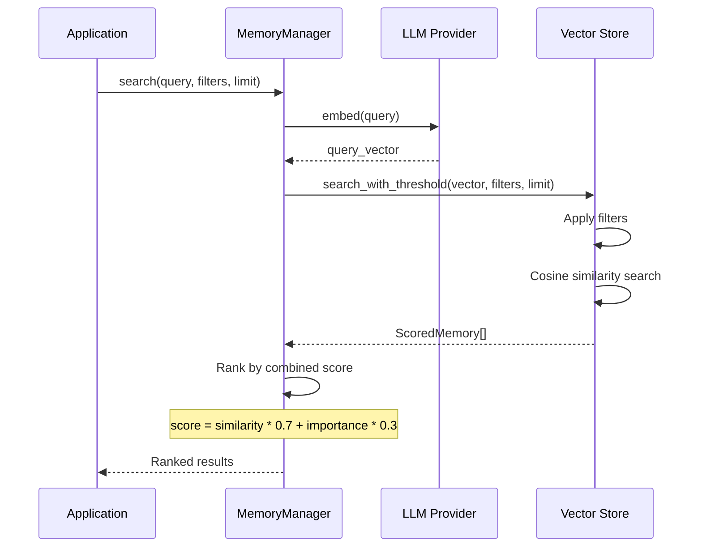

# Memory Pipeline

The Memory Pipeline is the core process that transforms raw conversations and text into structured, searchable memories. This document explains each stage of the pipeline in detail.

---

## Pipeline Overview

```
┌─────────────┐     ┌─────────────┐     ┌─────────────┐     ┌─────────────┐
│   Input     │────▶│  Extraction │────▶│ Enhancement │────▶│   Storage   │
│  (Messages) │     │   (Facts)   │     │  (Metadata) │     │  (Vector)   │
└─────────────┘     └─────────────┘     └─────────────┘     └─────────────┘
                                                                   │
                                                                   ▼
┌─────────────┐     ┌─────────────┐     ┌─────────────┐     ┌─────────────┐
│  Response   │◀────│   Ranking   │◀────│    Search   │◀────│    Query    │
│  (Results)  │     │   (Score)   │     │  (Vector)   │     │   (Text)    │
└─────────────┘     └─────────────┘     └─────────────┘     └─────────────┘
```

---

## Stage 1: Input Processing

### Input Types

The pipeline accepts two main types of input:

#### 1. Conversation Messages
```rust
use cortex_mem_core::types::Message;

let messages = vec![
    Message::user("I love hiking in the mountains"),
    Message::assistant("That's great! Do you have a favorite trail?")
        .with_name("Assistant"),
    Message::user("Yes, I love the Appalachian Trail"),
];
```

#### 2. Direct Content
```rust
let content = "User enjoys hiking, specifically the Appalachian Trail";
```

### Message Format

```rust
pub struct Message {
    pub role: String,      // "user", "assistant", "system"
    pub content: String,   // The actual message
    pub name: Option<String>, // Optional identifier
}
```

---

## Stage 2: Fact Extraction

### Extraction Strategy Selection

The pipeline analyzes the conversation context to select the optimal extraction strategy:

```rust
enum ExtractionStrategy {
    DualChannel,      // Extract both user and assistant facts
    UserOnly,         // Extract user facts only
    AssistantOnly,    // Extract assistant facts only
    ProceduralMemory, // Extract step-by-step procedures
}
```

**Strategy Selection Logic**:
- **DualChannel**: Default for mixed conversations
- **UserOnly**: When learning user preferences
- **AssistantOnly**: When documenting agent capabilities
- **ProceduralMemory**: When detecting step-by-step patterns

### Dual-Channel Extraction

#### User Fact Extraction

Uses specialized prompts to extract only user-relevant information:

```rust
// User Memory Extraction Prompt
const USER_MEMORY_EXTRACTION_PROMPT: &str = r#"
You are a Personal Information Organizer...

Types of Information to Remember:
1. Store Personal Preferences
2. Maintain Important Personal Details
3. Track Plans and Intentions
4. Remember Activity Preferences
5. Monitor Health and Wellness
6. Store Professional Details
7. Miscellaneous Information

Return: {"facts": ["fact 1", "fact 2", ...]}
"#;
```

**Example**:
```
Input: "I love Italian food, especially pasta with pesto"
Output: {"facts": [
    "User loves Italian food",
    "User's favorite pasta dish is pesto pasta"
]}
```

#### Assistant Fact Extraction

Extracts information about the AI assistant:

```rust
// Assistant Memory Extraction Prompt
const AGENT_MEMORY_EXTRACTION_PROMPT: &str = r#"
You are an Assistant Information Organizer...

Types of Information to Remember:
1. Assistant's Preferences
2. Assistant's Capabilities
3. Assistant's Hypothetical Plans
4. Assistant's Personality Traits
5. Assistant's Approach to Tasks
6. Assistant's Knowledge Areas
"#;
```

### Procedural Memory Extraction

Special handling for step-by-step procedures:

```rust
// Detect procedural patterns
fn detect_procedural_pattern(messages: &[Message]) -> bool {
    let procedural_keywords = [
        "steps", "actions", "process", 
        "first", "then", "finally",
        "how to", "procedure"
    ];
    
    // Check for keywords + alternating pattern
    has_procedural_keywords && has_alternating_pattern
}
```

**Example**:
```
Input: [
    "How do I bake sourdough bread?",
    "First, feed your starter. Then mix flour and water..."
]

Output: {
    "facts": [
        "Step 1: Feed the sourdough starter",
        "Step 2: Mix flour and water",
        "Step 3: ..."
    ],
    "category": "Procedural"
}
```

### Extraction Pipeline



### Extracted Fact Structure

```rust
pub struct ExtractedFact {
    pub content: String,           // The extracted fact
    pub importance: f32,           // 0.0 - 1.0
    pub category: FactCategory,    // Personal, Preference, Factual, etc.
    pub entities: Vec<String>,     // Named entities
    pub language: Option<LanguageInfo>, // Detected language
    pub source_role: String,       // "user" or "assistant"
}
```

---

## Stage 3: Memory Enhancement

### Enhancement Process

Once facts are extracted, each memory is enhanced with additional metadata:



### 1. Embedding Generation

```rust
// Generate vector embedding for semantic search
let embedding = llm_client.embed(&fact.content).await?;
```

**Process**:
- Text is sent to embedding model (e.g., text-embedding-3-small)
- Returns high-dimensional vector (e.g., 1536 dimensions)
- Vector captures semantic meaning

### 2. Memory Classification

```rust
// Classify memory type using LLM
let memory_type = memory_classifier.classify_memory(&content).await?;
```

**Classification Categories**:
- Personal
- Procedural
- Factual
- Semantic
- Episodic
- Conversational

### 3. Entity Extraction

```rust
// Extract named entities
let entities = memory_classifier.extract_entities(&content).await?;
// e.g., ["Rust", "Tokio", "Async"]
```

### 4. Topic Extraction

```rust
// Extract topics
let topics = memory_classifier.extract_topics(&content).await?;
// e.g., ["programming", "concurrency"]
```

### 5. Importance Evaluation

```rust
// Evaluate importance score
let importance = importance_evaluator.evaluate_importance(memory).await?;
// Returns: 0.0 - 1.0
```

**Factors Considered**:
- Content length
- Entity density
- Personal information indicators
- Action items
- Temporal relevance

### 6. Duplicate Detection

```rust
// Check for existing similar memories
let duplicates = duplicate_detector.detect_duplicates(memory).await?;

if !duplicates.is_empty() {
    // Merge with existing memories
    let merged = duplicate_detector.merge_memories(&all_memories).await?;
}
```

**Duplicate Detection Methods**:
- Hash comparison (exact duplicates)
- Semantic similarity (near-duplicates)
- LLM-based comparison (context-aware)

---

## Stage 4: Storage

### Vector Store Insertion

```rust
// Store in Qdrant
vector_store.insert(&memory).await?;
```

**Storage Format**:
```json
{
  "id": "uuid",
  "content": "Extracted fact content",
  "embedding": [0.23, -0.56, 0.89, ...],
  "metadata": {
    "user_id": "user123",
    "agent_id": "agent456",
    "memory_type": "Personal",
    "importance_score": 0.85,
    "entities": ["entity1", "entity2"],
    "topics": ["topic1", "topic2"],
    "hash": "sha256_hash",
    "created_at": "2024-01-15T10:30:00Z",
    "updated_at": "2024-01-15T10:30:00Z"
  }
}
```

### Metadata Indexing

Qdrant indexes metadata fields for filtering:
- `user_id` - For user isolation
- `agent_id` - For agent isolation
- `memory_type` - For type filtering
- `importance_score` - For salience filtering
- `created_at_ts` - For time range queries
- `entities` - For entity-based search
- `topics` - For topic-based search

---

## Stage 5: Retrieval Pipeline

### Query Processing

```rust
let results = memory_manager.search(
    "What does the user like to eat?",  // Query
    &Filters::for_user("user123"),       // Filters
    5                                     // Limit
).await?;
```

### Retrieval Process



### Combined Scoring

```rust
// Combined score calculation
let combined_score = similarity_score * 0.7 + importance_score * 0.3;

// Sort by combined score, then by recency
results.sort_by(|a, b| {
    let score_cmp = b.combined_score.partial_cmp(&a.combined_score);
    match score_cmp {
        Some(Ordering::Equal) | None => {
            b.memory.created_at.cmp(&a.memory.created_at)
        }
        Some(ordering) => ordering,
    }
});
```

### Filtering

```rust
pub struct Filters {
    pub user_id: Option<String>,
    pub agent_id: Option<String>,
    pub memory_type: Option<MemoryType>,
    pub min_importance: Option<f32>,
    pub max_importance: Option<f32>,
    pub created_after: Option<DateTime<Utc>>,
    pub created_before: Option<DateTime<Utc>>,
    pub entities: Option<Vec<String>>,
    pub topics: Option<Vec<String>>,
    pub custom: HashMap<String, serde_json::Value>,
}
```

---

## Stage 6: Memory Update Pipeline

### Smart Updates

When updating existing memories:

```rust
// Update with smart merging
memory_manager.smart_update(id, new_content).await?;
```

**Process**:
1. Retrieve existing memory
2. Extract facts from new content
3. Compare with existing content
4. Merge if related
5. Update embedding
6. Store updated version

### Memory Actions

The updater can perform different actions:

```rust
pub enum MemoryAction {
    Create { content: String, metadata: MemoryMetadata },
    Update { id: String, content: String },
    Merge { target_id: String, source_ids: Vec<String>, merged_content: String },
    Delete { id: String },
}
```

---

## Pipeline Configuration

### Performance Tuning

```toml
[memory]
# Fact extraction
auto_enhance = true        # Enable automatic enhancement

# Duplicate handling
deduplicate = true         # Enable duplicate detection
merge_threshold = 0.75     # Similarity threshold for merging

# Search configuration
similarity_threshold = 0.65    # Min similarity for results
search_similarity_threshold = 0.50  # Filter threshold
max_search_results = 50     # Default result limit

# Importance
auto_summary_threshold = 32768  # Content length for auto-summarization
```

### Optimization Schedule

```toml
[memory.optimization]
enabled = true
schedule = "0 2 * * 0"  # Weekly on Sunday at 2 AM
strategies = ["deduplication", "quality", "relevance"]
```

---

## Error Handling

### Pipeline Errors

```rust
pub enum MemoryError {
    VectorStore(QdrantError),  // Vector DB errors
    LLM(String),               // LLM API errors
    Serialization(JsonError),  // JSON parsing errors
    NotFound { id: String },   // Memory not found
    Validation(String),        // Invalid input
    // ...
}
```

### Recovery Strategies

1. **LLM Failures**: Fallback to simpler extraction
2. **Vector Store Unavailable**: Queue for retry
3. **Timeout**: Partial results with warning
4. **Invalid Content**: Skip and log error

---

## Monitoring and Observability

### Pipeline Metrics

```rust
// Track pipeline performance
struct PipelineMetrics {
    extraction_time_ms: u64,
    enhancement_time_ms: u64,
    storage_time_ms: u64,
    total_memories_processed: u64,
    facts_extracted: u64,
    duplicates_found: u64,
}
```

### Logging

```rust
// Pipeline stages are logged
tracing::info!("Starting fact extraction for {} messages", messages.len());
tracing::debug!("Extracted {} facts", facts.len());
tracing::info!("Memory stored with ID: {}", memory_id);
```

---

## Best Practices

### 1. Batch Processing
Process multiple messages together for better context:

```rust
// Better: Process conversation as a whole
let results = memory_manager.add_memory(&messages, metadata).await?;

// Rather than individual messages
for msg in messages {
    memory_manager.store(msg.content, metadata.clone()).await?;
}
```

### 2. Appropriate Filtering
Use filters to narrow search scope:

```rust
// Good: Filter by user and type
let filters = Filters::for_user("user123")
    .with_memory_type(MemoryType::Personal);

// Less efficient: Search everything
let filters = Filters::new();
```

### 3. Importance Scoring
Set appropriate importance for different memory types:

```rust
let metadata = MemoryMetadata::new(MemoryType::Personal)
    .with_importance_score(0.9);  // High importance

let metadata = MemoryMetadata::new(MemoryType::Conversational)
    .with_importance_score(0.5);  // Neutral importance
```

### 4. Regular Optimization
Schedule periodic optimization:

```bash
# Manual optimization
cortex-mem-cli optimize start

# Or configure auto-optimization
[memory]
auto_optimize = true
```

---

## Next Steps

- [Architecture Overview](./architecture.md) - Understand system components
- [Memory Types](./memory-types.md) - Learn about different memory categories
- [Optimization System](./optimization.md) - Automated memory maintenance
- [Vector Store](./vector-store.md) - Deep dive into vector storage
