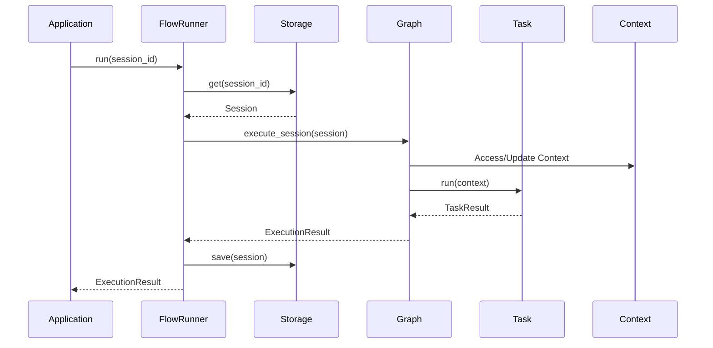

# Architecture Overview

Understanding GraphFlow's architecture and design principles.

---

## System Architecture

```
┌─────────────────────────────────────────────────────────────┐
│                      Application Layer                      │
│  ┌─────────────┐  ┌─────────────┐  ┌─────────────────────┐ │
│  │   Tasks     │  │   Graph     │  │   FlowRunner        │ │
│  │  (Business  │  │  (Workflow  │  │  (Orchestration)    │ │
│  │   Logic)    │  │   Structure)│  │                     │ │
│  └──────┬──────┘  └──────┬──────┘  └──────────┬──────────┘ │
│         │                │                     │            │
│         └────────────────┴─────────────────────┘            │
│                          │                                  │
└──────────────────────────┼──────────────────────────────────┘
                           │
┌──────────────────────────┼──────────────────────────────────┐
│                    Core Engine                              │
│  ┌───────────────────────┴──────────────────────────────┐  │
│  │                    Context                           │  │
│  │  ┌──────────────┐  ┌──────────────┐  ┌────────────┐  │  │
│  │  │  Data Store  │  │ Chat History │  │   State    │  │  │
│  │  │  (DashMap)   │  │  (VecDeque)  │  │ Management │  │  │
│  │  └──────────────┘  └──────────────┘  └────────────┘  │  │
│  └──────────────────────────────────────────────────────┘  │
└─────────────────────────────────────────────────────────────┘
                           │
┌──────────────────────────┼──────────────────────────────────┐
│                   Storage Layer                             │
│  ┌───────────────────────┴──────────────────────────────┐  │
│  │  InMemoryStorage    │    PostgreSQLStorage           │  │
│  │  (Development)      │    (Production)                │  │
│  └──────────────────────────────────────────────────────┘  │
└─────────────────────────────────────────────────────────────┘
```

---

## Core Components

### 1. Task

The fundamental unit of work.

```rust
#[async_trait]
pub trait Task: Send + Sync {
    fn id(&self) -> &str;
    async fn run(&self, context: Context) -> Result<TaskResult>;
}
```

**Responsibilities:**
- Execute business logic
- Read/write context
- Return execution result with next action

**Characteristics:**
- Stateless (all state in context)
- Async by design
- Type-safe via generics
- Composable and reusable

---

### 2. Graph

Defines workflow structure and executes tasks.

```rust
pub struct Graph {
    id: String,
    tasks: DashMap<String, Arc<dyn Task>>,
    edges: Mutex<Vec<Edge>>,
    start_task_id: Mutex<Option<String>>,
}
```

**Responsibilities:**
- Store tasks and edges
- Execute tasks in order
- Handle conditional routing
- Manage execution flow

**Execution Model:**
- Single task execution (step-by-step)
- Context passed between tasks
- Execution status returned to caller

---

### 3. Context

Thread-safe state container.

```rust
pub struct Context {
    data: Arc<DashMap<String, Value>>,
    chat_history: Arc<RwLock<ChatHistory>>,
}
```

**Responsibilities:**
- Store workflow state
- Manage chat history
- Provide thread-safe access
- Enable serialization

**Features:**
- Type-safe storage via serde
- Synchronous and async access
- Automatic message limits
- Full serialization support

---

### 4. Session

Workflow execution instance.

```rust
pub struct Session {
    pub id: String,
    pub graph_id: String,
    pub current_task_id: String,
    pub status_message: Option<String>,
    pub context: Context,
}
```

**Responsibilities:**
- Track execution position
- Maintain workflow state
- Enable persistence
- Support resumption

---

### 5. Storage

Pluggable persistence layer.

**Traits:**
```rust
#[async_trait]
pub trait SessionStorage: Send + Sync {
    async fn save(&self, session: Session) -> Result<()>;
    async fn get(&self, id: &str) -> Result<Option<Session>>;
    async fn delete(&self, id: &str) -> Result<()>;
}
```

**Implementations:**
- `InMemorySessionStorage` - Fast, non-persistent
- `PostgresSessionStorage` - Persistent, scalable

---

### 6. FlowRunner

High-level execution orchestrator.

```rust
pub struct FlowRunner {
    graph: Arc<Graph>,
    storage: Arc<dyn SessionStorage>,
}
```

**Responsibilities:**
- Load session from storage
- Execute one graph step
- Save updated session
- Handle errors

**Benefits:**
- Eliminates boilerplate
- Ensures consistent state
- Simplifies error handling
- Optimized for web services

---

## Data Flow

### Task Execution Flow



### State Management

```
┌──────────────┐     ┌──────────────┐     ┌──────────────┐
│   Task A     │────▶│   Context    │────▶│   Task B     │
│  (Updates)   │     │  (Shared)    │     │  (Reads)     │
└──────────────┘     └──────────────┘     └──────────────┘
                           │
                           ▼
                    ┌──────────────┐
                    │   Session    │
                    │ (Persistent) │
                    └──────────────┘
```

---

## Design Principles

### 1. Type Safety

Compile-time guarantees prevent runtime errors:

```rust
// Context provides type-safe access
let name: Option<String> = context.get("name").await;
let count: Option<i32> = context.get("count").await;
```

### 2. Stateless Tasks

Tasks don't hold state - everything is in context:

```rust
// Good: Stateless task
struct MyTask;

#[async_trait]
impl Task for MyTask {
    async fn run(&self, context: Context) -> Result<TaskResult> {
        let data = context.get("data").await;
        // Process...
        Ok(TaskResult::new(response, NextAction::Continue))
    }
}

// Avoid: Stateful task
struct BadTask {
    data: String, // Don't do this
}
```

### 3. Explicit Control Flow

Tasks explicitly control workflow progression:

```rust
Ok(TaskResult::new(response, NextAction::Continue))        // Step-by-step
Ok(TaskResult::new(response, NextAction::ContinueAndExecute)) // Continuous
Ok(TaskResult::new(response, NextAction::WaitForInput))    // Interactive
Ok(TaskResult::new(response, NextAction::End))             // Complete
```

### 4. Thread Safety

All components are `Send + Sync`:

- `Arc<Graph>` - Share across threads
- `Context` - Thread-safe via DashMap
- `SessionStorage` - Async trait for concurrent access

### 5. Composability

Build complex workflows from simple tasks:

```rust
let graph = GraphBuilder::new("complex")
    .add_task(validate_task)
    .add_task(process_task)
    .add_task(notify_task)
    .add_edge(validate_task.id(), process_task.id())
    .add_edge(process_task.id(), notify_task.id())
    .build();
```

---

## Execution Models

### Step-by-Step (Interactive)

```rust
loop {
    let result = runner.run(session_id).await?;
    
    match result.status {
        ExecutionStatus::Completed => break,
        ExecutionStatus::Paused { .. } => continue,
        ExecutionStatus::WaitingForInput => {
            // Get input from user
            continue;
        }
        _ => break,
    }
}
```

**Use Cases:**
- Web services
- Interactive applications
- Human-in-the-loop

### Continuous (Batch)

Use `ContinueAndExecute` for automatic execution:

```rust
// Task returns ContinueAndExecute
Ok(TaskResult::new(response, NextAction::ContinueAndExecute))
```

**Use Cases:**
- Batch processing
- Automated workflows
- Data pipelines

### Mixed

Combine both in the same workflow:

```rust
// Automated steps use ContinueAndExecute
// Interactive steps use Continue or WaitForInput
```

---

## Performance Characteristics

### Memory Usage

- **Task**: Zero overhead (just vtable)
- **Context**: O(n) where n = stored values
- **Session**: Context + metadata
- **Graph**: O(t + e) where t = tasks, e = edges

### Execution Overhead

- **Task Dispatch**: ~100ns (vtable call)
- **Context Access**: O(1) via DashMap
- **Storage**: Depends on backend
  - In-Memory: ~1μs
  - PostgreSQL: ~5-10ms

### Concurrency

- **Tasks**: Sequential within a session
- **Sessions**: Fully concurrent
- **FanOut**: Parallel task execution

---

## Extension Points

### Custom Tasks

Implement the `Task` trait:

```rust
#[async_trait]
impl Task for MyCustomTask {
    async fn run(&self, context: Context) -> Result<TaskResult> {
        // Custom logic
    }
}
```

### Custom Storage

Implement `SessionStorage`:

```rust
#[async_trait]
impl SessionStorage for MyStorage {
    async fn save(&self, session: Session) -> Result<()> {
        // Custom persistence
    }
    // ...
}
```

### Custom Edge Conditions

Use closures for conditional routing:

```rust
.add_conditional_edge(
    from_id,
    |ctx| {
        let value: Option<i32> = ctx.get_sync("value");
        value.map(|v| v > 10).unwrap_or(false)
    },
    yes_id,
    no_id,
)
```

---

## Next Steps

- [Tasks](./tasks.md) - Deep dive into task system
- [Graph Execution](./graph-execution.md) - How graphs execute
- [Context and State](./context.md) - State management
- [Storage](./storage.md) - Persistence options
