# AI's Trillion-Dollar Opportunity: Context Graphs

> **Source:** [Foundation Capital](https://foundationcapital.com/context-graphs-ais-trillion-dollar-opportunity/)
> **Published:** December 22, 2025
> **Authors:** Jaya Gupta & Ashu Garg
> **Referenced companion piece:** Jamin Ball — ["Long Live Systems of Record"](https://cloudedjudgement.substack.com/p/clouded-judgement-121225-long-live) (Clouded Judgement)

---

The last generation of enterprise software created a trillion-dollar ecosystem by becoming systems of record. Salesforce for customers. Workday for employees. SAP for operations. Own the canonical data, own the workflow, own the lock-in.

The debate right now is whether those systems survive the shift to agents. Jamin Ball's recent post "Long Live Systems of Record" hit a nerve. Pushing back on the "agents kill everything" narrative, he argues that agents don't replace systems of record, they raise the bar for what a good one looks like.

We agree. Agents are cross-system and action-oriented. The UX of work is separating from the underlying data plane. Agents become the interface, but something still has to be canonical underneath.

Where we go further is this: Ball's framing assumes the data agents need already lives somewhere, and agents just need better access to it plus better governance, semantic contracts, and explicit rules about which definition wins for which purpose.

That's half the picture. The other half is the missing layer that actually runs enterprises: **the decision traces** – the exceptions, overrides, precedents, and cross-system context that currently live in Slack threads, deal desk conversations, escalation calls, and people's heads.

This is the distinction that matters:

**Rules** tell an agent *what should happen in general* ("use official ARR for reporting")

**Decision traces** capture *what happened in this specific case* ("we used X definition, under policy v3.2, with a VP exception, based on precedent Z, and here's what we changed").

Agents don't just need rules. They need access to the decision traces that show how rules were applied in the past, where exceptions were granted, how conflicts were resolved, who approved what, and which precedents actually govern reality.

This is where systems of agents startups have a structural advantage. They sit **in the execution path**. They see the full context at decision time: what inputs were gathered across systems, what policy was evaluated, what exception route was invoked, who approved, and what state was written. If you persist those traces, you get something that doesn't exist in most enterprises today: a queryable record of how decisions were made.

We call the accumulated structure formed by those traces a **context graph**: not "the model's chain-of-thought," but a living record of decision traces stitched across entities and time so precedent becomes searchable. Over time, that context graph becomes the real source of truth for autonomy – because it explains not just *what* happened, but *why it was allowed* to happen.

The core question isn't whether existing systems of record survive. It's whether entirely new ones emerge – systems of record for decisions, not just objects – and whether those become the next trillion-dollar platforms.

---

> [!NOTE]
> ### 🔵 Claude's Note — Rules vs. Decision Traces
>
> This distinction is the crux of the entire thesis and worth internalizing. Think of it in database terms:
> - **Rules** = schema constraints (CHECK, FOREIGN KEY, NOT NULL)
> - **Decision traces** = the full transaction log WITH the human reasoning that triggered each commit
>
> Current enterprise systems store the *final state* (the row after UPDATE) but discard the *decision context* (why the UPDATE happened, who approved it, what precedent justified it). The context graph is essentially **event sourcing for business judgment**.
>
> For anyone building in the Rust/systems space: this maps cleanly to the distinction between a write-ahead log (WAL) that captures *what changed* and an event-sourced architecture that captures *why it changed and who decided it*.

---

## What Systems of Record Don't Capture

Agents are shipping into real workflows – contract review, quote-to-cash, support resolution – and teams are hitting a wall that governance alone can't solve.

The wall isn't missing data. It's missing decision traces. Agents run into the same ambiguity humans resolve every day with judgment and organizational memory. But the inputs to those judgments aren't stored as durable artifacts. Specifically:

- **Exception logic that lives in people's heads.** "We always give healthcare companies an extra 10% because their procurement cycles are brutal." That's not in the CRM. It's tribal knowledge passed down through onboarding and side conversations.

- **Precedent from past decisions.** "We structured a similar deal for Company X last quarter – we should be consistent." No system links those two deals or records why the structure was chosen.

- **Cross-system synthesis.** The support lead checks the customer's ARR in Salesforce, sees two open escalations in Zendesk, reads a Slack thread flagging churn risk, and decides to escalate. That synthesis happens in their head. The ticket just says "escalated to Tier 3."

- **Approval chains that happen outside systems.** A VP approves a discount on a Zoom call or in a Slack DM. The opportunity record shows the final price. It doesn't show who approved the deviation or why.

This is what "never captured" means. Not that the data is dirty or siloed, but that the reasoning connecting data to action was never treated as data in the first place.

```mermaid
graph TD
    subgraph "What Systems of Record CAPTURE"
        A["📊 Final State<br/>(Opportunity: 20% discount)"]
        B["📋 Object Data<br/>(Account, Contact, Deal)"]
        C["📅 Timestamps<br/>(Created, Modified)"]
    end

    subgraph "What Systems of Record MISS"
        D["🧠 Exception Logic<br/>(Tribal knowledge in people's heads)"]
        E["🔗 Precedent Links<br/>(Similar deal for Company X last quarter)"]
        F["🔀 Cross-System Synthesis<br/>(ARR + Escalations + Slack churn signal)"]
        G["✅ Approval Context<br/>(VP approved on Zoom call — why?)"]
    end

    D -->|"Never persisted"| H["⚫ Decision Trace Gap"]
    E -->|"Never linked"| H
    F -->|"Never recorded"| H
    G -->|"Never captured"| H

    H -->|"This is what<br/>Context Graphs solve"| I["🌐 Context Graph"]

    style H fill:#ff6b6b,stroke:#c0392b,color:#fff
    style I fill:#2ecc71,stroke:#27ae60,color:#fff
```

---

## The Context Graph Is the Enduring Layer

When startups instrument the agent orchestration layer to emit a decision trace on every run, they get something enterprises almost never have today: a structured, replayable history of how context turned into action.

*What does this look like in practice?* A renewal agent proposes a 20% discount. Policy caps renewals at 10% unless a service-impact exception is approved. The agent pulls three SEV-1 incidents from PagerDuty, an open "cancel unless fixed" escalation in Zendesk, and the prior renewal thread where a VP approved a similar exception last quarter. It routes the exception to Finance. Finance approves. The CRM ends up with one fact: "20% discount."

```mermaid
graph LR
    subgraph "Inputs Gathered"
        PD["🚨 PagerDuty<br/>3× SEV-1 incidents"]
        ZD["📞 Zendesk<br/>'Cancel unless fixed'<br/>escalation"]
        PR["📁 Prior Renewal<br/>VP-approved similar<br/>exception last quarter"]
        PO["📜 Policy v3.2<br/>10% cap unless<br/>service-impact exception"]
    end

    subgraph "Decision Event"
        AG["🤖 Renewal Agent<br/>proposes 20% discount"]
        EX["⚖️ Exception Route<br/>service-impact path invoked"]
        AP["✅ Finance Approves"]
    end

    subgraph "What Gets Stored"
        direction TB
        CRM["CRM Record<br/><b>'20% discount'</b><br/>(just the final state)"]
        CG["Context Graph Trace<br/><b>Full decision lineage:</b><br/>inputs + policy + exception<br/>+ approver + precedent"]
    end

    PD --> AG
    ZD --> AG
    PR --> AG
    PO --> AG
    AG --> EX --> AP

    AP -->|"Today"| CRM
    AP -->|"With Context Graph"| CG

    style CRM fill:#e74c3c,stroke:#c0392b,color:#fff
    style CG fill:#2ecc71,stroke:#27ae60,color:#fff
```

Once you have decision records, the "why" becomes first-class data. Over time, these records naturally form a **context graph**: the entities the business already cares about (accounts, renewals, tickets, incidents, policies, approvers, agent runs) connected by decision events (the moments that matter) and "why" links. Companies can now audit and debug autonomy and turn exceptions into precedent instead of re-learning the same edge case in Slack every quarter.

**The feedback loop is what makes this compound.** Captured decision traces become searchable precedent. And every automated decision adds another trace to the graph.

```mermaid
graph TD
    A["🤖 Agent Encounters<br/>Ambiguous Case"] --> B["🔍 Searches Context Graph<br/>for Precedent"]
    B --> C{"Similar precedent<br/>found?"}
    C -->|Yes| D["⚡ Applies precedent<br/>(faster resolution)"]
    C -->|No| E["👤 Routes to Human<br/>(human-in-the-loop)"]
    D --> F["📝 Emits New<br/>Decision Trace"]
    E --> F
    F --> G["🌐 Context Graph<br/>Grows"]
    G -->|"More precedent<br/>= more autonomy"| A

    style G fill:#3498db,stroke:#2980b9,color:#fff
    style F fill:#9b59b6,stroke:#8e44ad,color:#fff
```

None of this requires full autonomy on day one. It starts with human-in-the-loop: the agent proposes, gathers context, routes approvals, and records the trace. Over time, as similar cases repeat, more of the path can be automated because the system has a structured library of prior decisions and exceptions. Even when a human still makes the call, the graph keeps growing, because the workflow layer captures the inputs, approval, and rationale as durable precedent instead of letting it die in Slack.

---

> [!NOTE]
> ### 🔵 Claude's Note — The Compounding Flywheel
>
> This is the most defensible part of the thesis. It's a classic **data network effect**:
>
> More workflows mediated → more decision traces captured → better precedent library → more edge cases automatable → more workflows mediated.
>
> The comparison to event sourcing is apt but undersells it. Event sourcing captures *what happened*. A context graph captures *what happened + why + under what authority + with what precedent*. It's closer to a **case law system** for enterprise operations — each decision becomes citable precedent.
>
> This is also why the "start with human-in-the-loop" strategy is smart: you don't need to solve full autonomy to start accumulating the graph. Every human decision routed through the system is another trace.

---

## Why Incumbents Can't Build the Context Graph

Ball is optimistic that existing players evolve into this architecture. Warehouses become "truth registries," while CRMs become "state machines with APIs." His is a narrative of evolution, not replacement.

That might work for making existing data more accessible. It doesn't work for capturing decision traces.

### Operational Incumbents Are Siloed and Prioritize Current State

Salesforce is pushing Agentforce, ServiceNow has Now Assist, and Workday is building agents for HR. Their pitch is "we have the data, now we add the intelligence."

But these agents inherit their parent's architectural limitations. Salesforce is built on current state storage: it knows what the opportunity looks like now, not what it looked like when the decision was made. When a discount gets approved, the context that justified it isn't preserved. You can't replay the state of the world at decision time, which means you can't audit the decision, learn from it, or use it as precedent.

They also inherit their parent's blind spots. A support escalation doesn't live in Zendesk alone. It depends on customer tier from the CRM, SLA terms from billing, recent outages from PagerDuty, and the Slack thread flagging churn risk. No incumbent sees this because no incumbent sits in the cross-system path.

### The Warehouse Players Have a Different Problem: They're in the Read Path, Not the Write Path

Ball positions Snowflake and Databricks as the "truth registry" layer. Both are leaning in – Snowflake pushing Cortex and acquiring Streamlit, Databricks acquiring Neon and launching Lakebase and AgentBricks. The pitch: data platforms replace systems of record and become the foundation for AI agents.

Warehouses do have a time-based view. You can query historical snapshots, track how metrics changed, and compare state across periods. But warehouses receive data via ETL after decisions are made. By the time data lands in Snowflake, the decision context is gone.

A system that only sees reads, after the fact, can't be the system of record for decision lineage. It can tell you what happened, but it can't tell you why.

Databricks is further along in putting the pieces together. But being close to where agents get built isn't the same as being in the execution path where decisions happen.

### Systems of Agents Startups Have a Structural Advantage: They're in the Orchestration Path

When an agent triages an escalation, responds to an incident, or decides on a discount, it pulls context from multiple systems, evaluates rules, resolves conflicts, and acts. The orchestration layer sees the full picture: what inputs were gathered, what policies applied, what exceptions were granted, and why. Because it's executing the workflow, it can capture that context at decision time – not after the fact via ETL, but in the moment, as a first-class record.

**That's the context graph, and that will be the single most valuable asset for companies in the era of AI.**

```mermaid
graph TB
    subgraph "OPERATIONAL INCUMBENTS"
        direction TB
        SF["Salesforce / ServiceNow / Workday"]
        SF_PROB["❌ Current-state only<br/>❌ Single-system view<br/>❌ Can't replay decision context"]
    end

    subgraph "WAREHOUSE PLAYERS"
        direction TB
        WH["Snowflake / Databricks"]
        WH_PROB["✅ Time-based view<br/>❌ Read path only (post-ETL)<br/>❌ Decision context lost by arrival"]
    end

    subgraph "SYSTEMS OF AGENTS STARTUPS"
        direction TB
        SA["Orchestration-layer startups"]
        SA_ADV["✅ In the execution/write path<br/>✅ See full cross-system context<br/>✅ Capture at decision time"]
    end

    SF --> SF_PROB
    WH --> WH_PROB
    SA --> SA_ADV

    SA_ADV -->|"Can build"| CG["🌐 Context Graph<br/>(Decision Lineage)"]

    style SF_PROB fill:#e74c3c,stroke:#c0392b,color:#fff
    style WH_PROB fill:#f39c12,stroke:#e67e22,color:#fff
    style SA_ADV fill:#2ecc71,stroke:#27ae60,color:#fff
    style CG fill:#3498db,stroke:#2980b9,color:#fff
```

**Incumbents will fight back.** They'll try acquisitions to bolt on orchestration capabilities. They'll lock down APIs and adopt egress fees to make data extraction expensive – the same playbook hyperscalers used. They'll build their own agent frameworks and push "keep everything in our ecosystem" narratives.

But capturing decision traces requires being in the execution path at commit time, not bolting on governance after the fact. Incumbents can make extraction harder, but they can't insert themselves into an orchestration layer they were never part of.

---

> [!NOTE]
> ### 🔵 Claude's Note — Read Path vs. Write Path
>
> This "read path vs. write path" framing is the sharpest insight in the piece and maps directly to systems architecture:
>
> | Player | Path | Analogy |
> |--------|------|---------|
> | **SaaS Incumbents** (Salesforce, etc.) | Write path, but siloed — only see their own system | A single microservice that only sees its own DB |
> | **Warehouses** (Snowflake, Databricks) | Read path — receive data after ETL | A read replica that gets CDC events minutes/hours later |
> | **Orchestration Startups** | Write path, cross-system — see the full transaction | The API gateway / saga orchestrator that coordinates across all services |
>
> The warehouse problem is particularly interesting: they have *temporal* data (SCD Type 2, time-travel queries) but not *decisional* data. You can ask Snowflake "what was this customer's ARR on March 15?" but not "why did we approve a 20% discount on March 15?"
>
> For builders: if you're designing an agentic system, **emit structured decision events** at every decision point. Don't just log; create first-class decision records with: inputs gathered, policy evaluated, exception invoked, approver, outcome, and links to precedent. This is what makes the graph queryable.

---

## Three Paths for Startups

Systems of agents startups will take different paths, each of which has its own tradeoffs.

### Path 1: Replace Existing Systems of Record From Day One

A CRM or ERP rebuilt around agentic execution, with event-sourced state and policy capture native to the architecture. This is hard because incumbents are entrenched, but it becomes viable at transition moments.

Of the many startups going after the AI SDR category, [Regie](https://www.regie.ai/) has chosen to build an AI-native sales engagement platform to replace legacy platforms like Outreach/Salesloft, which were designed for humans executing sequences across a fragmented toolchain. Regie is designed for a mixed team where the agent is a first-class actor: it can prospect, generate outreach, run follow-ups, handle routing, and escalate to humans.

### Path 2: Replace Modules Rather Than Entire Systems

These startups target specific sub-workflows where exceptions and approvals concentrate, then become the system of record for those decisions while syncing final state back to the incumbent.

[Maximor](https://www.maximor.ai/) is doing this in finance: automating cash, close management, and core accounting workflows without ripping out the GL. The ERP remains the ledger, but Maximor becomes the source of truth where the reconciliation logic lives.

### Path 3: Create Entirely New Systems of Record

These startups start as orchestration layers, but they persist what enterprises never systematically stored: the decision-making trace. Over time that replayable lineage becomes the authoritative artifact. The agent layer stops being "just automation" and becomes the place the business goes to answer "why did we do that?"

[PlayerZero](https://playerzero.ai/) exemplifies this pattern. Production engineering sits at the intersection of SRE, support, QA, and dev: a classic "glue function" where humans carry context that software doesn't capture. PlayerZero starts by automating L2/L3 support, but the real asset is the context graph it builds: a living model of how code, config, infrastructure, and customer behavior interact in reality. That graph becomes the source of truth for "why did this break?" and "will this change break production?": questions no existing system can answer.

```mermaid
graph LR
    subgraph "Path 1: Full Replacement"
        R1["Replace entire SoR<br/>(CRM, ERP)"]
        R1E["Example: <b>Regie</b><br/>AI-native sales engagement<br/>replacing Outreach/Salesloft"]
        R1 --- R1E
    end

    subgraph "Path 2: Module Replacement"
        R2["Replace specific<br/>sub-workflows"]
        R2E["Example: <b>Maximor</b><br/>Finance automation<br/>ERP stays, logic moves"]
        R2 --- R2E
    end

    subgraph "Path 3: New System of Record"
        R3["Start as orchestration,<br/>become the SoR<br/>for decisions"]
        R3E["Example: <b>PlayerZero</b><br/>Production engineering<br/>context graph"]
        R3 --- R3E
    end

    R1 -.->|"Hardest:<br/>entrenched incumbents"| RISK["⚠️ Risk / Difficulty"]
    R2 -.->|"Moderate:<br/>must sync with incumbent"| RISK
    R3 -.->|"Easiest entry:<br/>capturing what didn't exist"| RISK

    style R1 fill:#e74c3c,stroke:#c0392b,color:#fff
    style R2 fill:#f39c12,stroke:#e67e22,color:#fff
    style R3 fill:#2ecc71,stroke:#27ae60,color:#fff
```

**As startups pursue these paths, observability for agents will become critical infrastructure.** As decision traces accumulate and context graphs grow, enterprises will need to monitor, debug, and evaluate agent behavior at scale.

[Arize](https://arize.com/) is building the observability layer for this new stack – giving teams visibility into how agents reason, where they fail, and how their decisions perform over time. Just as Datadog became essential infrastructure for monitoring applications, Arize is positioned to become essential infrastructure for monitoring and improving agent decision quality.

---

## Key Signals for Founders

The signals for where to build overlap, but they aren't identical.

### Two Signals That Apply to All Three Opportunities

**High headcount.** If a company has 50 people doing a workflow manually (routing tickets, triaging requests, or reconciling data between systems), that's a signal. The labor exists because the decision logic is too complex to automate with traditional tooling.

**Exception-heavy decisions.** Routine, deterministic workflows don't need decision lineage: the agent just executes. The interesting surfaces are where the logic is complex, where precedent matters, and where "it depends" is the honest answer. Think use cases like deal desks, underwriting, compliance reviews, and escalation management.

### One Signal Points Specifically to New System of Record Opportunities

**Organizations that exist at the intersection of systems.** RevOps exists because someone has to reconcile sales, finance, marketing, and customer success. DevOps exists because someone has to bridge development, IT, and support. Security Ops sits between IT, engineering, and compliance.

These "glue" functions are a tell. They emerge precisely because no single system of record owns the cross-functional workflow. The org chart creates a role to carry the context that software doesn't capture.

An agent that automates that role doesn't just run steps faster. It can persist the decisions, exceptions, and precedents the role was created to produce. That's the path to a new system of record: not by ripping out an incumbent, but by capturing a category of truth that only becomes visible once agents sit in the workflow.

```mermaid
graph TD
    subgraph "Glue Functions = New SoR Opportunities"
        RO["RevOps"]
        DO["DevOps"]
        SO["SecOps"]
    end

    subgraph "RevOps bridges..."
        S["Sales"] --- F["Finance"]
        F --- M["Marketing"]
        M --- CS["Customer Success"]
    end

    subgraph "DevOps bridges..."
        DEV["Development"] --- IT["IT"]
        IT --- SUP["Support"]
    end

    subgraph "SecOps bridges..."
        IT2["IT"] --- ENG["Engineering"]
        ENG --- COMP["Compliance"]
    end

    RO -.->|"No single SoR<br/>owns this"| S
    DO -.->|"No single SoR<br/>owns this"| DEV
    SO -.->|"No single SoR<br/>owns this"| IT2

    RO --> OPP["🎯 Agent captures<br/>the cross-system<br/>decision traces<br/>these roles carry"]
    DO --> OPP
    SO --> OPP

    style OPP fill:#3498db,stroke:#2980b9,color:#fff
```

---

## Systems of Record, Reimagined

The question isn't whether systems of record survive – they will. The question is whether the next trillion-dollar platforms are built by adding AI to existing data, or by capturing the decision traces that make data actionable.

We think it's the latter. And the startups building context graphs today are laying the foundation.

---

> [!NOTE]
> ### 🔵 Claude's Extended Notes & Analysis
>
> #### Strengths of This Thesis
>
> 1. **The "read path vs. write path" framing is genuinely novel.** Most SaaS-vs-AI discourse focuses on whether agents replace apps. This piece sidesteps that debate entirely by identifying a *new category of data* that neither incumbents nor warehouses are structurally positioned to capture. That's a much stronger argument than "agents kill CRMs."
>
> 2. **The compounding flywheel is real.** Context graphs exhibit data network effects: every decision trace makes the next decision faster and better. This creates genuine defensibility — not just switching costs, but an accumulating asset that competitors can't replicate without also being in the execution path.
>
> 3. **The "glue function" signal is actionable.** Identifying cross-functional roles (RevOps, DevOps, SecOps) as indicators of missing systems of record is a practical heuristic for founders.
>
> #### Questions & Tensions Worth Noting
>
> 1. **Who owns the context graph when there are multiple orchestration layers?** If a company uses Regie for sales, Maximor for finance, and PlayerZero for production engineering, you get three separate context graphs. The cross-graph synthesis problem just moves up a layer. The authors don't address this — and it's the same fragmentation problem they critique in incumbents.
>
> 2. **Privacy and compliance implications are enormous.** A context graph that records "VP approved exception because customer threatened to churn" creates legal discovery exposure. Decision traces are incredibly valuable for learning but also for litigation. Enterprises will need to solve the "right to explain" vs. "right to forget" tension.
>
> 3. **The event-sourcing analogy has known scaling challenges.** Event-sourced systems can grow unboundedly. Context graphs that store every decision trace, every input, every precedent link will face storage, query performance, and data governance challenges at enterprise scale.
>
> 4. **Incumbent response may be faster than expected.** Salesforce's acquisition machine is well-oiled. If Agentforce agents start emitting decision traces into Salesforce's data model, they *would* be in the write path for their own system. The question is whether cross-system context can be captured from within a single vendor's ecosystem — and with MCP/tool-use proliferating, it might be more feasible than the authors suggest.
>
> #### Relevance to the Brazilian Health Insurance Market (ANS/Aether Context)
>
> This thesis maps remarkably well to health insurance brokerage:
>
> - **Exception-heavy decisions** are the norm: plan recommendations depend on beneficiary demographics, ANS regulatory constraints, carrier network adequacy, price negotiations, and broker relationships — most of which live in brokers' heads.
> - **Cross-system synthesis** is constant: ANS public data (TISS, RPC, DIOPS) + carrier portals + CRM + commission tracking + regulatory updates all feed into a single recommendation decision.
> - **"Glue function" roles** abound: operations coordinators who bridge sales, carriers, regulatory compliance, and claims.
>
> An Aether-like platform that captures *why* a broker recommended Plan X over Plan Y — including the ANS regulatory context, carrier negotiation history, and client-specific exceptions — would be building exactly the kind of context graph this article describes. The decision traces in health insurance brokerage are valuable, high-stakes, and currently living entirely in people's heads and WhatsApp threads.

---

*Markdown conversion by Claude · February 2026*
*Original content © Foundation Capital 2025. All rights reserved.*
